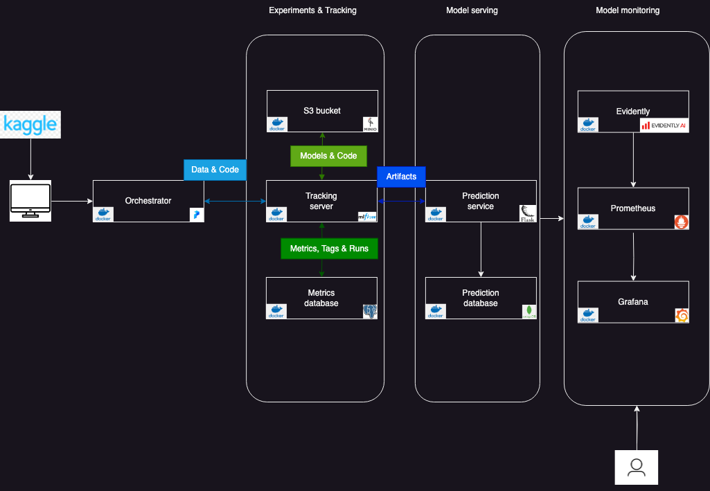

# Bank credit card churn prediction

## Introduction

In a highly competitive market, customers have a plethora of options to chose from when it comes to availaing credit card services. In order
to boost sales and increase market share banks tend to woo their customers with credit cards that offer a multitude of benefits. Some customers
take advantage of such schemes by applying for a card and using up the benefits before cancelling the card; this is called credit card churning.
The churn rate is the percentage of the bank's customer's who have attrited. By building a Machine learning model, a bank can quickly estimate the
number of customers who are likely to churn; this could result in huge cost savings for the bank

## Dataset

The dataset is obtained from [Kaggle](https://www.kaggle.com/datasets/whenamancodes/credit-card-customers-prediction?resource=download); the attributes
that make up the dataset are as follows:<br>
- `CLIENTNUM`  - Unique identifier for the customer holding the account<br/>
- `Attrition_Flag`   - Internal event (customer activity) variable - if the account is closed then 1 else 0<br/>
- `Customer_Age`  - Demographic variable - Customer's Age in Years<br/>
- `Gender`  - Demographic variable - M=Male, F=Female<br/>
- `Dependent_count`  - Demographic variable - Number of dependents<br/>
- `Education_Level`  - Demographic variable - Educational Qualification of the account holder (example: high school, college graduate, etc.)<br/>
- `Marital_Status`   - Demographic variable - Married, Single, Divorced, Unknown<br/>
- `Income_Category`  - Demographic variable - Annual Income Category of the account holder (< $40K, $40K - 60K, $60K - $80K, $80K-$120K, ><br/>
- `Card_Category` - Product Variable - Type of Card (Blue, Silver, Gold, Platinum)<br/>
- `Monthsonbook`  - Period of relationship with bank<br/>
- `TotalRelationshipcount` - Total no. of products held by the customer<br/>
- `MonthsInactive12_mon`   - No. of months inactive in the last 12 months<br/>
- `ContactsCount12_mon` - No. of Contacts in the last 12 months<br/>
- `Credit_Limit`  - Credit Limit on the Credit Card<br/>
- `TotalRevolvingBal`   - Total Revolving Balance on the Credit Card<br/>
- `AvgOpenTo_Buy` - Open to Buy Credit Line (Average of last 12 months)<br/>
- `TotalAmtChngQ4Q1` - Change in Transaction Amount (Q4 over Q1)<br/>
- `TotalTransAmt` - Total Transaction Amount (Last 12 months)<br/>
- `TotalTransCt`  - Total Transaction Count (Last 12 months)<br/>
- `TotalCtChngQ4Q1`  - Change in Transaction Count (Q4 over Q1)<br/>
- `AvgUtilizationRatio` - Average Card Utilization Ratio<br/>

The response variable is: `Attrition flag`

Only a subset of these were used for training; these are listed in the `settings.py` file.

The best trained model that is available locally was trained on the entire dataset, but for the purposes of the demo, only a subset of the dataset
was uploaded to Github due to size limitations.

## Objective

The goal of this project was not so much to build a high performing prediction model than it was to build an end to end machine learning ops pipeline;
the emphasis was less on feature engineering and hyperparameter tuning and more on model deployment, experimentation and tracking, monitoring and serving. Additionally, the other aspects of software engineering were also explored, such as: adding test cases, integration tests, quality checks and precommit hooks and github action.

## MLOps pipeline

### Architecture



### Model serving

The MLOps pipeline is fully dockerised (Make sure to install Docker and docker-compose) and can be easily deployed via the following steps:

1. Clone the `credit_churn_predicton` repository locally:

    ```
    git clone https://github.com/sl2902/credit_churn_prediction.git
    ```

2. Prepare your environment to run the pipeline:

    ```
    cd credit_churn_prediction
    make setup
    ```

3. Build and launch the MLOps pipeline:

    ```
    make build
    ```
    Once ready, the following containers will be available:

    |Names  			          |     Port|Description       						  |
    |-----------------------------|--------:|:----------------------------------------|
    |app   						  |     9696|Web service api						  |
    |prefect					  |     4200|Training workflow orchestration		  |
    |capstone_evidently_service_1 |     8085|ML observability platform			      |
    |capstone_grafana_1			  |     3000|Dashboard							      |
    |mlflow_server				  |	    5000|Tracking server					      |
    |create_bucket       		  |        -|Command to create bucket				  |
    |minio						  |9000/9001|Cloud object store compatible with AWS S3|
    |capstone_prometheus_1		  |     9090|Database used with Evidently and Grafana |
    |mlflow_db  				  |     5432|Postgres database						  |
    |capstone_mongo_1             |    27018|Mongo database							  |

4. Send traffic to the app service

    ```
    make post_request
    ```
    This will used the model that has already been trained, and which is stored on disk

5. Launch grafana at http://127.0.0.1:3000

    


## Training and deployment

1. To orchestrate the training workflow via Prefect, run the following command

    ```
    make deployment
    ```
    This will create a remote storage using Minio services, followed by deploying and applying the orchestration pipeline,
    which is scheduled to run daily at midnight. The agent is started to pick up any queued jobs.

2. Executes the training workflow, which includes reading a subset of the dataset stored in `data` folder, transforming the
    required attributes, splitting the dataset into various susbets, pickling the prepared subsets, and carrying out experimenting
    and tracking using mlflow to pick the model that has the highest auc roc; the models are persisted on Minio S3.

    ```
    make train
    ```

3.  Once ready, restart the docker service
    ```
    make restart
    ```

4.  Send traffic to the app service

    ```
    make post_request
    ```

## Shutdown

Once done, you can shutdown the docker services

1. Stop the running services

    ```
    make stop
    ```

2. Clean up the environment

    ```
    make clean
    ```

## Testing, Integration testing and Quality checks

1. Run unit tests

    ```
    make unit_tests
    ```
    These test both the training data preparation pipeline and prediction pipeline

2. Deploy integration tests

    ```
    make run_docker_integration
    ```
    This command starts the docker compose services inside the `integration_tests` folder

3. Run integration tests

    ```
    run_integration_tests
    ```
    These will test both the training pipeline and the prediction services

4. Run quality checks

    ```
    quality_checks
    ```
    Runs the `isort`, `black` and `pylint` on the `scripts` folder

## Pre-commit hooks

1. Pre-commit hooks, including sorting, formatting, linting and unit tests are run with every commit to the repository.

## CI/CD

1. A git pull will trigger the CI pipeline; it does the following:

   - Prepares the environment and install the dependencies
   - Runs the unit tests
   - Runs the quality checks
   - Builds and runs the docker container services for the integration tests
   - Runs the integration tests

## References

[1] https://www.youtube.com/playlist?list=PL3MmuxUbc_hIUISrluw_A7wDSmfOhErJK
[2] https://github.com/minio/blog-assets/tree/main
[3] https://github.com/evidentlyai/evidently/tree/main/examples/integrations/grafana_monitoring_service
